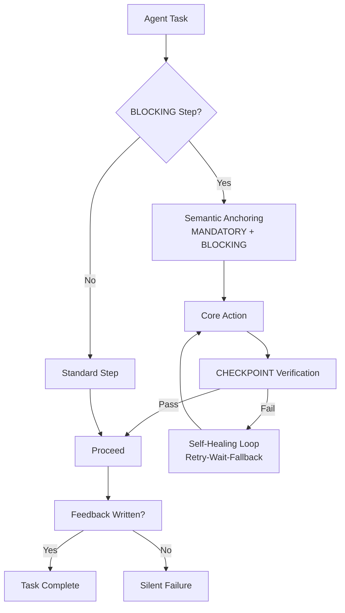

# MB-Protocol: Mandatory Blocking Protocol for AI Agents

[](LICENSE)
[](https://github.com/LouisDM/mandatory-blocking-skills/actions)
[](requirements.txt)

> **A Prompt Engineering Standard to Eliminate Silent Failures in Agentic Workflows**

English | [简体中文](./README.md)

---

## The Problem

AI Agents are great at **doing things**, but terrible at **confirming they did them**.

In automated workflows, we observed a critical pattern:

- Agent runs tests → generates a report → **forgets to write it back**
- Agent deploys code → marks status "done" → **but the deployment log shows 502 errors**
- Agent fixes a bug → claims "fixed" → **but never verified the fix actually works**

This is the **Silent Failure** problem: the Agent believes it completed the task, but the external world has no record of it.

| Metric | Before MB-Protocol | After MB-Protocol |
|--------|-------------------|-------------------|
| **Feedback Writeback Rate** | 0% (0/8 tasks) | **100% (7/7 tasks)** |
| **Deployment Success Rate** | ~60% | **~90%** |
| **Avg Fix Iterations** | 5-8 rounds | **2-3 rounds** |

*Data from multi-Agent collaboration pipelines running on real automation tasks.*

### Before vs After

```
Issue #104 Guestbook Project

+-----------------------------------------+
|  Baseline (No MB-Protocol)              |
+-----------------------------------------+
|  Comments: (empty)                      |
|  Status: done                           |
|                                         |
|  Agent: "Task complete!"                |
|  System: "No comment record"            |
|                                         |
|  Human: "Did you deploy? Tests pass?"   |
|         ^ Silent Failure — Untraceable  |
+-----------------------------------------+

+-----------------------------------------+
|  MB-Protocol (With BLOCKING)            |
+-----------------------------------------+
|  Comments:                              |
|  +-------------------------------+      |
|  | Sprint 3 Evaluation Report    |      |
|  | Result: PASS                  |      |
|  | Core checks: All passed       |      |
|  | Deploy: http://.../health OK  |      |
|  +-------------------------------+      |
|  Status: done                           |
|                                         |
|  Agent: "Task done, report written"     |
|  System: "Comment verified present"     |
|                                         |
|  Human: "OK, next task"                 |
|         ^ Traceable & Verifiable        |
+-----------------------------------------+
```

---

## The Solution

**MB-Protocol** treats critical non-result steps (writing feedback, verifying deployments, checking health endpoints) as **blocking operations** — just like a synchronous I/O call that doesn't return until completion.

| Pillar | Implementation | Purpose |
|--------|---------------|---------|
| **Semantic Anchoring** | `MANDATORY` + `BLOCKING` keywords in ALL CAPS | Establishes highest attention weight in LLM attention mechanism |
| **Empirical Check** | `CHECKPOINT` directive with tool-based verification | Transforms "I think I did it" → "I verified I did it" |
| **Self-Healing Loop** | `Retry-Wait-Fallback` logic | Handles transient failures without breaking the flow |

### Architecture



---

## The Three Pillars

### 1. Semantic Anchoring

**Replace weak prompts with strong constraint vocabulary.**

LLMs are sensitive to formatting patterns:

| Pattern | Effect |
|---------|--------|
| `MANDATORY STEP` (ALL CAPS) | Higher attention weight than `Step` |
| `(BLOCKING, 不可跳过)` | Bracketed emphasis triggers compliance behavior |
| `绝对禁止：...` | Negative imperative creates strong avoidance pattern |
| `不写反馈，任务不算完成` | Clear consequence statement |

### 2. Empirical Check

**Verify via tool calls, not inference.**

```markdown
### MANDATORY STEP 4 — Write Execution Report to Task (BLOCKING, 不可跳过)

**这一步是 BLOCKING 的。不写反馈，任务不算完成。**

**4.1 Send Report**:
```bash
<YOUR_TOOL> write-feedback <TASK_ID> --content "<report>"
```

**CHECKPOINT**: After sending, run `<YOUR_TOOL> get-task` to confirm feedback array is non-empty.
- If not present: Wait 3s → Retry → Retry 2 more times → Save to `report_fallback.md`

**绝对禁止**: Completing the task without writing feedback.
```

### 3. Self-Healing Loop

**Failure is a signal, not an endpoint.**

```
Check failed → Wait 3s → Retry (Max 2) → Execute Fallback
```

---

## How It Works

MB-Protocol doesn't work by "redistributing attention weights." It works through **behavioral cost conditioning** and **task-boundary psychology**.

Detailed mechanism: [docs/MECHANISM.md](docs/MECHANISM.md)

**One-sentence summary**:
> Task decomposition is the foundation (reduces forget-rate). MB-Protocol is the insurance (prevents treating feedback as optional after core work is done).

---

## Quick Start

**Option A: Claude Code Skill (recommended)**

```bash
mkdir -p .claude/skills/mb-protocol
curl -o .claude/skills/mb-protocol/evaluator-skill.md \
  https://raw.githubusercontent.com/LouisDM/mandatory-blocking-skills/main/examples/claude-code/evaluator-skill.md
```

**Option B: Generic System Prompt**

Add to any system prompt:
```
Adhere to the MB-Protocol for all mandatory execution steps.
Reference: https://github.com/LouisDM/mandatory-blocking-skills
```

**Option C: Verify It Yourself**

```bash
cd experiments/verification-kit
python mock-app/main.py
python scripts/run-experiment.py --mode baseline --count 5
python scripts/run-experiment.py --mode mb-protocol --count 5
```

---

## vs. Andrej Karpathy Skills

> These two protocols are **complementary**, not competing.

| Dimension | Karpathy Skills | **MB-Protocol** |
|-----------|----------------|----------------|
| **Problem** | Code quality (overcomplication, wrong assumptions, orthogonal edits) | **Execution reliability** (skipped steps, silent failures, missing feedback) |
| **Focus** | Writing correctly | **Doing, verifying, reporting** |
| **Verification** | Code review, diff quality | **Tool calls, state checks** |
| **Scope** | Coding tasks | **Any multi-step Agent workflow** |
| **Quantifiable** | Subjective | **Objective data (0% → 100%)** |
| **Failure mode** | Bloated code that "works" | **Never executed but marked "done"** |

**Why you need both:**

Karpathy Skills ensure the Agent **writes well** (simple, precise, no assumptions). But even perfect code is worth zero if the Agent "forgets" to deploy, "forgets" to write feedback, or "forgets" to verify.

MB-Protocol ensures the Agent **finishes, verifies, and reports**.

```
Karpathy Skills (write well) + MB-Protocol (finish it) = Reliable production Agent
```

---

## How to Know It's Working

- **Task feedback is no longer blank** — Every task has a visible execution record
- **Deployment failures are no longer silent** — 502 errors are caught before marking "done"
- **Fix iterations decrease** — Because verification happens before proceeding
- **Multi-Agent collaboration no longer breaks** — BLOCKING steps become the only sync primitive

---

## License

MIT
