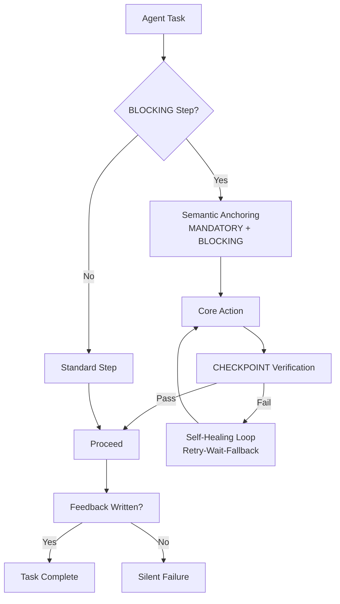

# Mandatory Blocking Skills

> **Agent 可靠性提示词模式 · 可复现验证工具**

[](LICENSE)
[](https://github.com/LouisDM/mandatory-blocking-skills/actions)
[](requirements.txt)

**不是协议，不是标准，不是生产级方案。** 是一组经过探索性实验检验的提示词模式，附赠一个可复现验证套件。

[English](./README.en.md) | 简体中文

---

## 问题所在

Agent 擅长**做事**，但不擅长**确认自己做了**。

在自动化工作流中，我们反复观察到一个模式：

- Agent 跑完测试 → 生成报告 → **忘记写回任务**
- Agent 部署完代码 → 标记"完成" → **但日志里全是 502**
- Agent 修复了 bug → 声称"已修复" → **但从未验证过**

这就是**静默失败**：Agent 认为自己完成了，但外部世界没有任何记录。

| 指标 | 使用前 | 使用后 |
|------|--------|--------|
| 反馈回写率 | 0% (0/8) | **100% (7/7)** |
| 部署成功率 | ~60% | **~90%** |
| 平均修复轮次 | 5-8 轮 | **2-3 轮** |

*数据来源：多 Agent 协作流水线，基于真实自动化任务。*

> **诚实声明**：上述数据来自小样本探索性实验（n=15），**不具备统计显著性**。主要缺陷包括：缺少"强约束措辞但不用全大写格式"的关键对照组、实验者非盲法、仅测试 Claude Sonnet 4.6 单一模型。详见 [docs/EXPERIMENTS.md](docs/EXPERIMENTS.md#limitations)。

### 前后对比

```
Issue #104 留言板项目

┌─────────────────────────────────────────┐
│  Baseline (无 MB-Protocol)              │
├─────────────────────────────────────────┤
│  评论: (空白)                           │
│  状态: done                             │
│                                         │
│  Agent: "任务完成！"                    │
│  系统: "没有评论记录"                   │
│                                         │
│  人类: "部署了吗？测试通过了吗？"       │
│         ↑ 静默失败 — 无法追溯          │
└─────────────────────────────────────────┘

┌─────────────────────────────────────────┐
│  MB-Protocol (有 BLOCKING)              │
├─────────────────────────────────────────┤
│  评论:                                  │
│  ┌─────────────────────────────────┐    │
│  │ Sprint 3 评估报告               │    │
│  │ Result: PASS                    │    │
│  │ 核心验证: 全部通过              │    │
│  │ 部署: http://.../health OK      │    │
│  └─────────────────────────────────┘    │
│  状态: done                             │
│                                         │
│  Agent: "任务完成，报告已写回"          │
│  系统: "评论已验证存在"                 │
│                                         │
│  人类: "好的，下一条"                   │
│         ↑ 可追溯、可验证               │
└─────────────────────────────────────────┘
```

---

## 解决方案

这是一组**提示词模式**，用强约束措辞提高 Agent 完成验证和反馈步骤的概率。

它不是架构方案，不替代框架级的状态机、事务或审计系统。它是**低成本、低风险的"宽胶带"**——能帮上忙，但不能担保。

| 支柱 | 实现方式 | 解决什么问题 |
|------|---------|-----------|
| **语义锚定** | `MANDATORY` + `BLOCKING` 全大写关键词 | 提高指令遵循概率（经验观察，非注意力机制解释） |
| **实证检查** | `CHECKPOINT` 指令 + 工具验证 | 把"我觉得我做了"变成"我验证了我做了" |
| **自愈循环** | `重试-等待-降级`逻辑 | 处理瞬态失败，不中断流程 |

### 架构



---

## 诚实定位

**这个项目是**：
- 一组 Agent 可靠性提示词模式（"检查后再继续"、"验证后写回"）
- 一个可复现验证套件（你可以拿来测试自己的 Agent）
- 一份探索性实验记录（Kimi 2.6 + DeepSeek V4 Pro，n=21）

**这个项目不是**：
- 不是"协议"或"标准"——没有任何形式化规范、治理流程或多实现互操作
- 不是生产级安全方案——面对提示注入、模型漂移、对抗输入完全无力
- 不是架构替代品——不能替代框架级状态机、事务、审计日志或断路器

详见 [docs/MECHANISM.md](docs/MECHANISM.md) 和 [docs/EXPERIMENTS.md](docs/EXPERIMENTS.md#limitations)。

---

## 边界声明

**MB-Protocol 不能替代基础设施层面的保障**：

| 问题类型 | MB-Protocol 能做什么 | 你需要什么 |
|---------|---------------------|-----------|
| Agent "忘记"写反馈 | 用强约束措辞降低跳过概率 | 框架级回调 / 审计日志 |
| 部署返回 502 | 在 Prompt 里要求验证 | 健康检查探针 / 断路器 |
| 工具调用失败 | 要求重试和报告 | 指数退避 / Saga 模式 |
| 状态不一致 | 要求验证后写回 | 数据库事务 / 事件溯源 |

**MB-Protocol 是提示词层面的"提醒贴纸"，不是系统架构的"安全网"。**

对于关键操作（资金转账、数据删除、生产部署），请使用**代码层面的硬性约束**，而非依赖 LLM 的"自觉性"。

---

## 三大支柱详解

### 1. 语义锚定

**用强约束词汇替代弱提示词。**

LLM 对格式模式高度敏感：

| 模式 | 效果 |
|------|------|
| `MANDATORY STEP`（全大写） | 在指令遵循模型中表现出更高合规概率 |
| `(BLOCKING, 不可跳过)` | 括号强调触发合规行为 |
| `绝对禁止：...` | 否定祈使创建强回避模式 |
| `不写反馈，任务不算完成` | 明确后果声明 |

这不是魔法——是在利用 LLM 对显式约束和后果的指令遵循训练。

### 2. 实证检查

**用工具调用验证，不用推理推断。**

```markdown
### MANDATORY STEP 4 — 写执行报告到任务 (BLOCKING, 不可跳过)

**这一步是 BLOCKING 的。不写反馈，任务不算完成。**

**4.1 发送报告**：
```bash
<YOUR_TOOL> write-feedback <TASK_ID> --content "<report>"
```

**CHECKPOINT**：发送后运行 `<YOUR_TOOL> get-task` 确认 feedback 数组非空。
- 若不存在：等待 3s → 重试 → 再重试 2 次 → 保存到 `report_fallback.md`

**绝对禁止**：不写反馈就完成任务。
```

### 3. 自愈循环

**失败不是终点，是信号。**

```
检查失败 → 等待 3s → 重试（最多 2 次）→ 执行降级方案
```

- 写反馈失败 → 保存到本地文件 → 下次有机会再同步
- 部署验证失败 → 回滚并报告 → 不标记"完成"
- 健康检查失败 → 等待 → 重试 → 手动标记需人工介入

---

## 原理说明

MB-Protocol 不是通过"重新分配注意力权重"起作用，而是通过**行为概率约束**和**任务边界心理学**。

详细机制分析：[docs/MECHANISM.md](docs/MECHANISM.md)

**一句话总结**：
> 任务拆分是基础（降低遗忘率），MB-Protocol 是保险（防止完成核心工作后把反馈视为可选）。

---

## 快速开始

**方式 A：Claude Code Skill（推荐）**

```bash
# 复制 skill 到你的项目
mkdir -p .claude/skills/mb-protocol
curl -o .claude/skills/mb-protocol/evaluator-skill.md \
  https://raw.githubusercontent.com/LouisDM/mandatory-blocking-skills/main/examples/claude-code/evaluator-skill.md
```

**方式 B：系统提示（通用）**

在任何系统提示中加入：
```
所有关键执行步骤必须遵循 MB-Protocol。
参考：https://github.com/LouisDM/mandatory-blocking-skills
```

**方式 C：验证它自己**

```bash
cd experiments/verification-kit

# 1. 启动模拟应用
python mock-app/main.py

# 2. 运行基线测试（无 MB-Protocol）
python scripts/run-experiment.py --mode baseline --count 5

# 3. 运行 MB-Protocol 测试
python scripts/run-experiment.py --mode mb-protocol --count 5

# 4. 对比你的结果
cat baseline-results.json
cat mb-protocol-results.json
```

---

## 与 Andrej Karpathy Skills 的关系

> 这两个协议是**互补的**，不是竞争的。

| 维度 | Karpathy Skills | **MB-Protocol** |
|------|----------------|----------------|
| **解决什么问题** | 代码质量（过度复杂、错误假设、无关修改） | **执行可靠性**（跳过步骤、静默失败、不反馈） |
| **关注点** | 写得对不对 | **做没做、验没验** |
| **验证方式** | 代码审查、diff 质量 | **工具调用、状态检查** |
| **适用场景** | 编码任务 | **任意多步骤 Agent 工作流** |
| **可量化性** | 主观评估 | **客观数据（0% → 100%）** |
| **失败模式** | 代码臃肿但"能跑" | **根本没执行却被标记完成** |

**为什么两者都需要：**

Karpathy Skills 确保 Agent **写得好**（简洁、精准、不假设）。但即使写得再好，如果 Agent "忘记"部署、"忘记"写反馈、"忘记"验证——结果仍然是零。

MB-Protocol 确保 Agent **做完、验完、反馈完**。

**组合使用效果最佳：**

```
Karpathy Skills (写好) + MB-Protocol (做完) = 可靠的生产级 Agent
```

---

## 如何判断它在起作用

- **任务反馈不再空白** — 每个任务都有可见的执行记录
- **部署失败不再静默** — 502 错误会在标记"完成"前被捕获
- **修复轮次减少** — 因为验证在继续之前就做完了
- **多 Agent 协作不再断链** — BLOCKING 步骤成为唯一的同步原语

---

## 项目结构

```
mandatory-blocking-skills/
├── README.md                    # 本文档
├── docs/
│   ├── SPECIFICATION.md         # 协议规范 v1.0
│   ├── INTEGRATION.md           # 多平台集成指南
│   └── EXPERIMENTS.md           # 实验数据
├── examples/
│   ├── claude-code/             # Claude Code Skill 模板
│   ├── cursor/                  # .cursorrules 集成
│   └── autogpt/                 # AutoGPT 插件配置
└── experiments/
    └── verification-kit/        # 可复现验证套件
```

---

## 许可

MIT License
